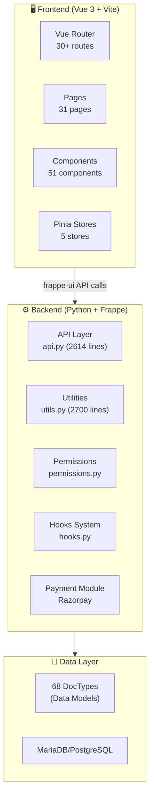
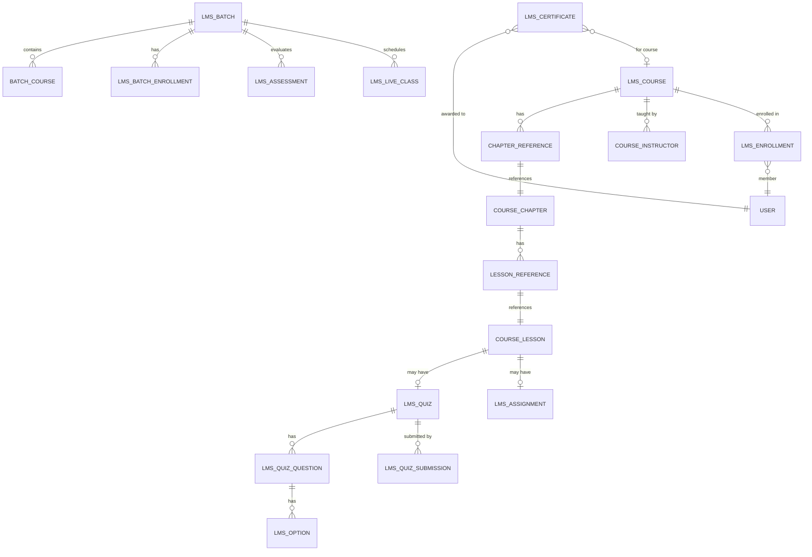
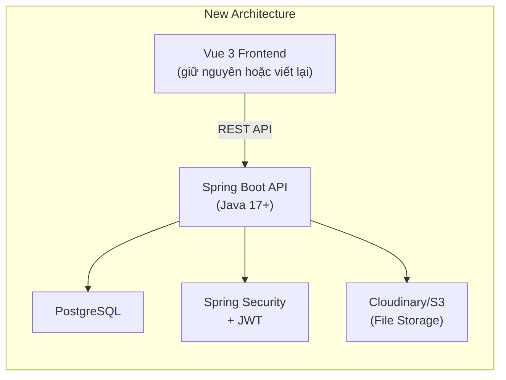

# 🎓 EduCore Project - Chi Tiết Review

## 1. Tổng Quan Dự Án

**EduCore** là một **fork** của [Frappe Learning](https://github.com/frappe/lms) — một hệ thống **Learning Management System (LMS)** mã nguồn mở được xây dựng trên **Frappe Framework**.

| Thuộc tính | Chi tiết |
|---|---|
| **Tên gốc** | Frappe Learning (LMS) |
| **License** | AGPL-3.0 |
| **Backend** | Python 3.10+ trên Frappe Framework (v14–v17) |
| **Frontend** | Vue 3.5 + Vite 5 + TailwindCSS 3 |
| **Database** | MariaDB (mặc định Frappe) hoặc PostgreSQL |
| **UI Library** | Frappe UI (Vue component library) |
| **Node** | >= 22 |
| **Testing** | Cypress (E2E), Vitest (Unit) |
| **Deploy** | Docker hoặc Frappe Cloud |

---

## 2. Kiến Trúc Hệ Thống



---

## 3. Data Models (68 DocTypes)

### Core Entities

| DocType | Mô tả | Quan hệ chính |
|---|---|---|
| **LMS Course** | Khóa học chính | → Chapter Reference, Course Instructor |
| **Course Chapter** | Chương trong khóa học | → Lesson Reference |
| **Course Lesson** | Bài học | → Quiz, Assignment |
| **LMS Batch** | Nhóm học viên | → Batch Course, Batch Enrollment |
| **LMS Enrollment** | Đăng ký khóa học | → User, Course |
| **LMS Quiz** | Bài kiểm tra | → LMS Question, LMS Option |
| **LMS Assignment** | Bài tập | → Assignment Submission |
| **LMS Certificate** | Chứng chỉ | → User, Course/Batch |

### Quan hệ dữ liệu (ERD tóm tắt)



### Danh sách đầy đủ 68 DocTypes

<details>
<summary>Click để xem toàn bộ</summary>

**Core Learning:**
- `LMS Course`, `Course Chapter`, `Course Lesson`, `Chapter Reference`, `Lesson Reference`
- `Course Instructor`, `Course Evaluator`
- `LMS Section`

**Enrollment & Progress:**
- `LMS Enrollment`, `LMS Course Progress`, `LMS Video Watch Duration`
- `LMS Batch`, `LMS Batch Enrollment`, `Batch Course`
- `LMS Program`, `LMS Program Course`, `LMS Program Member`

**Assessment:**
- `LMS Quiz`, `LMS Quiz Question`, `LMS Option`, `LMS Quiz Result`, `LMS Quiz Submission`
- `LMS Assignment`, `LMS Assignment Submission`
- `LMS Assessment`, `LMS Programming Exercise`, `LMS Programming Exercise Submission`
- `LMS Test Case`, `LMS Test Case Submission`

**Certification:**
- `LMS Certificate`, `LMS Certificate Evaluation`, `LMS Certificate Request`
- `Certification`, `Evaluator Schedule`

**Payment:**
- `LMS Payment`, `LMS Coupon`, `LMS Coupon Item`, `Payment Country`

**Live Class:**
- `LMS Live Class`, `LMS Live Class Participant`
- `LMS Zoom Settings`, `LMS Google Meet Settings`, `Zoom Settings`

**Scheduling:**
- `LMS Batch Timetable`, `LMS Timetable Legend`, `LMS Timetable Template`, `Scheduled Flow`

**User Profile:**
- `Education Detail`, `Work Experience`, `Skills`, `User Skill`
- `Preferred Function`, `Preferred Industry`, `Function`, `Industry`

**Job Board:**
- `Job Opportunity (via job module)`, Job Applications

**System:**
- `LMS Settings`, `LMS Sidebar Item`, `LMS Category`, `LMS Source`
- `LMS Badge`, `LMS Badge Assignment`
- `LMS Course Interest`, `LMS Course Mentor Mapping`, `LMS Course Review`
- `LMS Lesson Note`, `Related Courses`, `LMS Batch Feedback`

</details>

---

## 4. API Layer

File [api.py](file:///d:/du%20an/educore/lms/lms/api.py) — **2614 dòng** chứa tất cả REST endpoints:

### Nhóm API chính

| Nhóm | Endpoints | Mô tả |
|---|---|---|
| **User** | `get_user_info`, `get_all_users`, `get_members` | Quản lý người dùng |
| **Course** | `get_courses`, `get_course_details`, `save_course` | CRUD khóa học |
| **Lesson** | `create_lesson`, `delete_lesson`, `update_lesson_index` | Quản lý bài học |
| **Chapter** | `update_chapter_index` | Sắp xếp chương |
| **Quiz** | Quiz CRUD + submission | Kiểm tra |
| **Assignment** | Submission management | Bài tập |
| **Batch** | `get_batch_timetable`, enrollment | Quản lý batch |
| **Certificate** | `get_certified_participants` | Chứng chỉ |
| **Payment** | `get_payment_link`, `validate_billing_access` | Thanh toán (Razorpay) |
| **Job** | `get_job_opportunities`, `get_job_details` | Bảng việc làm |
| **Statistics** | `get_chart_data`, `get_chart_details` | Thống kê |
| **Settings** | `get_sidebar_settings`, branding | Cấu hình |
| **Translation** | `get_translations` | Đa ngôn ngữ |

---

## 5. Frontend Architecture

### Pages (31 pages)

| Nhóm | Pages |
|---|---|
| **Home** | `Home.vue` |
| **Courses** | `Courses.vue`, `CourseDetail.vue`, `CourseCertification.vue` |
| **Lessons** | `Lesson.vue` (33KB - lớn nhất), `LessonForm.vue` |
| **Batches** | `Batches.vue`, `BatchDetail.vue` |
| **Quiz** | `Quizzes.vue`, `QuizForm.vue`, `QuizPage.vue`, `QuizSubmission.vue`, `QuizSubmissionList.vue` |
| **Assignment** | `Assignments.vue`, `AssignmentSubmission.vue`, `AssignmentSubmissionList.vue` |
| **Program** | `Programs.vue`, `ProgramDetail.vue` |
| **Profile** | `Profile.vue`, `ProfileAbout.vue`, `ProfileCertificates.vue`, `ProfileRoles.vue`, `ProfileEvaluator.vue` |
| **Jobs** | `Jobs.vue`, `JobDetail.vue`, `JobForm.vue`, `JobApplications.vue` |
| **Others** | `Statistics.vue`, `Billing.vue`, `PersonaForm.vue`, `DataImport.vue`, `CertifiedParticipants.vue` |
| **SCORM** | `SCORMChapter.vue` |
| **Programming** | `ProgrammingExercises/` (3 pages) |

### State Management (Pinia)

| Store | Mô tả |
|---|---|
| `user.js` | Thông tin user đăng nhập |
| `session.js` | Session/authentication state |
| `settings.js` | LMS settings |
| `sidebar.js` | Sidebar navigation state |
| `notifications.js` | Real-time notifications |

### Components (51 components + 11 subdirectories)

Các component quan trọng:
- `Quiz.vue` (27KB) — Logic quiz phức tạp
- `Assignment.vue` (12KB) — Upload/submit bài tập  
- `CourseOutline.vue` (11KB) — Hiển thị cấu trúc khóa học
- `ChapterRow.vue` (9KB) — Drag-drop reorder
- `BlockEditor.vue` — EditorJS integration
- `VideoBlock.vue` — Video player (Plyr)

---

## 6. Hệ Thống Bảo Mật & Phân Quyền

### Role System

| Role | Quyền |
|---|---|
| **System Manager** | Full access |
| **Moderator** | Quản lý toàn bộ LMS content |
| **Course Creator** | CRUD khóa học, bài học |
| **Batch Evaluator** | Đánh giá, chấm điểm |
| **LMS Student** | Học, làm quiz, nộp bài |

### Permission Logic

```
Moderator/System Manager → Full access
Course Creator → Own courses only (can_modify_course check)
Batch Evaluator → Assigned batches
Student → Enrolled courses/batches
Guest → Only if allow_guest_access enabled + published + preview lessons
```

> [!NOTE]
> Hệ thống permission khá chặt chẽ với các hàm `can_modify_course()`, `can_modify_batch()`, `resolve_lesson_access()`, `can_access_quiz()` trong [permissions.py](file:///d:/du%20an/educore/lms/lms/permissions.py).

---

## 7. Tính Năng Đã Có

### ✅ Core Features
- [x] Quản lý khóa học (CRUD, publish/unpublish, featured)
- [x] Cấu trúc 3 tầng: Course → Chapter → Lesson
- [x] Rich content editor (EditorJS) cho bài học
- [x] Video embedding (YouTube, Vimeo, Cloudflare Stream, upload)
- [x] SCORM support (tiêu chuẩn e-learning)
- [x] Quiz (single-choice, multiple-choice, open-ended)
- [x] Assignment submission (PDF, Document)
- [x] Programming exercises với test cases
- [x] Progress tracking
- [x] Certificate generation
- [x] Certificate evaluation (peer review)

### ✅ Batch Management
- [x] Tạo batch với thời gian cụ thể
- [x] Enrollment (đăng ký vào batch)
- [x] Seat count management
- [x] Timetable/Schedule
- [x] Live class (Zoom + Google Meet integration)
- [x] Batch assessments

### ✅ Social & Profile
- [x] User profiles với bio, headline
- [x] Course reviews & ratings
- [x] Discussion system (per lesson & per batch)
- [x] Notifications (system + email)
- [x] @mentions trong discussions
- [x] Badge system

### ✅ Business
- [x] Paid courses & batches (Razorpay)
- [x] Coupon/discount system
- [x] Multi-currency support (auto exchange rate)
- [x] GST calculation (India)
- [x] Job board (posting + applications)

### ✅ Infrastructure
- [x] Docker support
- [x] CI/CD (GitHub Actions)
- [x] Cypress E2E tests
- [x] Vitest unit tests
- [x] i18n (đa ngôn ngữ, Crowdin)
- [x] PWA support (vite-plugin-pwa)
- [x] Full-text search (SQLite FTS)
- [x] Data import/export
- [x] Command palette

---

## 8. Đánh Giá Code Quality

### 👍 Điểm Mạnh

1. **Kiến trúc rõ ràng**: Frappe convention tách biệt DocType (model), API, utils, permissions
2. **Permission system**: Chặt chẽ, có rate limiting, validate input
3. **Test coverage**: Có unit test cho quiz, course, batch, email, SCORM
4. **Feature-rich**: Đầy đủ tính năng cho một LMS production
5. **Extensibility**: Plugin system, hook system, markdown macros
6. **Internationalization**: i18n ready với Crowdin
7. **Docker**: Production-ready container setup

### ⚠️ Điểm Cần Cải Thiện

1. **File quá lớn**:
   - `api.py`: 2614 dòng — nên tách thành modules (course_api, batch_api, quiz_api...)
   - `utils.py`: 2700 dòng — nên chia nhỏ theo domain
   
2. **Debug print statements** trong production code:
   ```python
   # utils.py line 126-131
   print(email)
   print(frappe.db.exists("User", email))
   print("existing_user", existing_user)
   print("User already exists")
   ```

3. **Thiếu type hints** ở nhiều function

4. **Frontend `Lesson.vue`** 33KB — component quá lớn, nên tách

5. **Không có API versioning** — khó migrate khi thay đổi

---

## 9. Có Thể Code Backend Bằng Java Không?

### ✅ CÓ THỂ — Nhưng cần hiểu rõ tradeoffs

> [!IMPORTANT]
> Dự án hiện tại **phụ thuộc hoàn toàn vào Frappe Framework** (Python). Chuyển sang Java nghĩa là bạn đang **viết lại toàn bộ backend từ đầu**, không phải "chuyển đổi" đơn giản.

### Phương án 1: Viết Backend Java riêng (Recommended cho học tập)

Xây dựng **REST API backend bằng Spring Boot** và giữ/viết lại frontend:



#### Mapping Frappe → Spring Boot

| Frappe Concept | Java/Spring Boot Equivalent |
|---|---|
| DocType (JSON schema) | JPA Entity (`@Entity`) |
| `frappe.whitelist()` | `@RestController` + `@GetMapping/@PostMapping` |
| `frappe.get_doc()` | `repository.findById()` |
| `frappe.db.get_value()` | JPA Query / `@Query` annotation |
| `frappe.session.user` | `SecurityContextHolder` (Spring Security) |
| `hooks.py` | Spring Events / `@EventListener` |
| `permissions.py` | `@PreAuthorize` / Custom `AccessDecisionVoter` |
| `frappe.sendmail()` | Spring Mail / JavaMailSender |
| `frappe.cache()` | Spring Cache / Redis |
| Scheduled Tasks | `@Scheduled` annotation |
| Frappe UI API calls | REST controller endpoints |

#### Các Entity cần tạo (tối thiểu)

```java
// Core Entities
@Entity User
@Entity Course          // LMS Course
@Entity Chapter         // Course Chapter  
@Entity Lesson          // Course Lesson
@Entity Enrollment      // LMS Enrollment
@Entity CourseProgress   // LMS Course Progress

// Assessment
@Entity Quiz            // LMS Quiz
@Entity Question        // LMS Question
@Entity QuizOption      // LMS Option
@Entity QuizSubmission  // LMS Quiz Submission
@Entity Assignment      // LMS Assignment
@Entity AssignmentSubmission

// Batch
@Entity Batch           // LMS Batch
@Entity BatchEnrollment // LMS Batch Enrollment
@Entity LiveClass       // LMS Live Class

// Others
@Entity Certificate     // LMS Certificate
@Entity Payment         // LMS Payment
@Entity CourseReview    // LMS Course Review
```

#### Tech Stack đề xuất cho Java Backend

| Layer | Technology |
|---|---|
| **Framework** | Spring Boot 3.x |
| **Language** | Java 17+ |
| **ORM** | Spring Data JPA + Hibernate |
| **Database** | PostgreSQL |
| **Auth** | Spring Security + JWT |
| **API Docs** | SpringDoc OpenAPI (Swagger) |
| **File Storage** | Cloudinary hoặc MinIO/S3 |
| **Caching** | Spring Cache + Redis |
| **Email** | Spring Mail |
| **Validation** | Bean Validation (Jakarta) |
| **Testing** | JUnit 5 + Mockito |
| **Build** | Maven hoặc Gradle |

### Phương án 2: Hybrid (Không khuyến khích)

Chạy cả Frappe backend + Spring Boot backend song song — quá phức tạp, không đáng.

### Phương án 3: Giữ nguyên Frappe (Nhanh nhất)

Nếu mục tiêu là deploy product → giữ Frappe, customize trên đó.

> [!TIP]
> **Nếu bạn muốn luyện Java backend** (giống VnNet project của bạn), thì **Phương án 1** là lý tưởng. Bạn đã có kinh nghiệm Spring Boot + JWT + PostgreSQL từ dự án VnNet, nên bạn hoàn toàn có thể áp dụng pattern tương tự cho LMS này.

---

## 10. Gợi Ý Các Bước Tiếp Theo

### 🔥 Nếu viết lại Backend Java (Phương án 1)

#### Phase 1: Foundation (2-3 tuần)
- [ ] Setup Spring Boot project (Spring Initializr)
- [ ] Cấu hình PostgreSQL + JPA + Flyway migrations
- [ ] Implement User entity + Spring Security + JWT auth
- [ ] Implement `AuthController` (register, login, refresh token)
- [ ] Setup CORS + global exception handling

#### Phase 2: Core LMS (3-4 tuần)
- [ ] Course CRUD API (`CourseController`, `CourseService`, `CourseRepository`)
- [ ] Chapter & Lesson CRUD (nested structure)
- [ ] Enrollment system (enroll, track progress)
- [ ] Course progress tracking
- [ ] File upload service (Cloudinary integration)

#### Phase 3: Assessment (2-3 tuần)  
- [ ] Quiz system (questions + options + scoring)
- [ ] Quiz submission & grading
- [ ] Assignment submission & review
- [ ] Certificate generation (PDF)

#### Phase 4: Batch & Live Class (2-3 tuần)
- [ ] Batch management (CRUD, enrollment, seat count)
- [ ] Timetable/schedule
- [ ] Zoom/Google Meet integration (optional)

#### Phase 5: Social & Polish (2 tuần)
- [ ] Discussion system (per lesson)
- [ ] Notifications (WebSocket)
- [ ] Course reviews & ratings
- [ ] Search functionality
- [ ] Statistics dashboard API

#### Phase 6: Frontend (2-4 tuần)
- [ ] Kết nối Vue frontend với Java API (thay đổi API calls)
- [ ] Hoặc viết frontend mới với Next.js/React

---

### 🚀 Nếu giữ Frappe Backend (Customize)

- [ ] **Tách file lớn**: `api.py` → modules riêng
- [ ] **Xóa debug prints** trong utils.py
- [ ] **Thêm type hints** cho tất cả functions
- [ ] **Thêm features**: gamification, learning paths, AI quiz generation
- [ ] **Cải thiện UI**: custom theme, mobile responsive
- [ ] **Thêm analytics**: learning analytics dashboard
- [ ] **Tích hợp AI**: chatbot hỗ trợ học tập

---

## 11. So Sánh với VnNet Project

Bạn đã có kinh nghiệm từ VnNet, đây là mapping:

| VnNet (đã làm) | EduCore (tương đương) |
|---|---|
| User entity + JWT | User entity + JWT (tương tự) |
| Post → Comment → Like | Course → Lesson → Progress |
| Friendship | Enrollment |
| Notification | Notification (tương tự) |
| Story (24h) | Live Class (scheduled) |
| Feed ranking | Course recommendation |
| — | **Mới**: Quiz, Assignment, Certificate, Payment |

> [!TIP]
> EduCore **phức tạp hơn** VnNet vì có thêm assessment, payment, scheduling, SCORM. Đây là cơ hội tốt để nâng cấp kỹ năng Java backend của bạn lên level tiếp theo!

